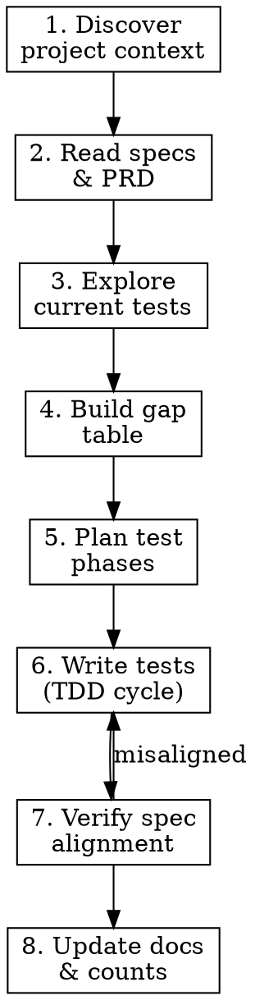

# Spec-Driven Test Coverage

Write deterministic unit tests that enforce an app's design specs, PRD, and implementation plans as CI-gated quality checks.

**Core principle:** Tests validate what the specs say the app does — not just what the code happens to do. Every test traces back to a documented behavior.

**REQUIRED BACKGROUND:** Follow superpowers:test-driven-development for the red-green-refactor cycle when writing tests for new behavior. For covering existing behavior, tests passing immediately is expected.

## Workflow



### Step 1: Discover project context

Before anything else, understand the project's testing setup:

- **Test framework:** Look for config files (`vitest.config.*`, `jest.config.*`, `pytest.ini`, `tsconfig.json`, `package.json` scripts)
- **Test location:** Find existing test files (`**/*.test.*`, `**/*.spec.*`, `__tests__/`, `tests/`)
- **Test libraries:** Check dependencies for testing-library, enzyme, supertest, etc.
- **CI pipeline:** Find `.github/workflows/`, `.gitlab-ci.yml`, `Jenkinsfile`, etc. — understand what gates merges
- **Spec/doc location:** Find design specs, PRDs, implementation plans (`docs/`, `specs/`, `*.md`)

Run the existing test suite to get baseline counts:
```bash
# Find and run the test command (varies by project)
npm run test:run    # or: pytest, cargo test, go test ./..., etc.
```

### Step 2: Read specs and PRD

Read all design docs to extract deterministic behaviors. Look for:

- **Data transformations** — filtering, sorting, grouping, formatting
- **Display rules** — what's shown/hidden, truncation, empty states
- **Status transitions** — valid state changes, side effects
- **Configuration** — model selections, token limits, tool subsets, thresholds
- **Boundary conditions** — time windows, rate limits, max counts
- **Validation rules** — required fields, format constraints, enum values

For each behavior, note the source document and section for traceability.

### Step 3: Explore current test coverage

For each test file, understand what behaviors are already covered. Build an inventory:
- Which source modules have tests?
- Which have partial coverage?
- Which have zero tests?

### Step 4: Build gap table

Map every spec requirement to test coverage:

| # | Spec requirement | Source doc | Tested? | Test file | Priority |
|---|---|---|---|---|---|
| R01 | Done tasks hidden from overview | PRD §3.2 | YES | task-groups.test.ts | — |
| R02 | Rate limit 30/member/hour | PRD §5.1 | YES | rate-limiter.test.ts | — |
| R03 | Tags max 2 + "+N more" | UX spec §4 | NO | — | High |

**Priority rules:**
1. **High** — Pure functions with no mocking needed
2. **High** — Component rendering with deterministic output from props
3. **Medium** — Agent/service configuration (model, tokens, tool subsets)
4. **Medium** — Tool routing and context injection
5. **Low** — Type/enum validation (often enforced by compiler)
6. **Skip** — CSS-only behaviors, browser APIs, non-deterministic AI output

### Step 5: Plan test phases

Group tests for incremental progress:

- **Phase 1: Pure functions** — Export private helpers if needed, test with plain assertions. Zero mocking.
- **Phase 2: Component/view rendering** — Mock only external deps (router, links). Test deterministic output from props.
- **Phase 3: Service/agent structure** — Mock external APIs. Verify configuration (model, tokens, tools), not AI output.
- **Phase 4: Routing/integration** — Mock lower-level modules. Verify correct wiring and context passing.

### Step 6: Write tests

**Key principles:**

- **Test behavior, not implementation.** Assert what users see, not internal state.
- **Mock sparingly.** Only mock external dependencies (databases, APIs, browser APIs). Test real functions.
- **Export private helpers.** When a module has pure functions worth testing directly, add `export`. This is a source change but not a behavioral change.
- **Reuse project patterns.** Match existing test file structure, fixture patterns, and mock conventions.
- **One test = one behavior.** If the test name has "and" in it, split it.

**Common patterns across frameworks:**

For private helpers that need testing:
```
// Before: function pad(n) { ... }
// After:  export function pad(n) { ... }
```

For components with browser APIs not available in test environment (scrollIntoView, visualViewport, etc.):
```
// Stub missing APIs in beforeEach
beforeEach(() => { Element.prototype.scrollIntoView = mockFn() })
```

For services that call external APIs:
```
// Mock the SDK, verify config (model, tokens), not response content
expect(apiCall.model).toBe('expected-model')
expect(apiCall.max_tokens).toBe(256)
```

### Step 7: Verify spec alignment

After writing tests, cross-check each test against the spec it validates:

| Spec requirement | Test file | Test name | Aligned? |
|---|---|---|---|
| Done tasks hidden | task-groups.test | excludes done tasks | Yes |
| Max 2 tags displayed | task-card.test | shows first 2 tags | Yes |

**If a test contradicts a spec:** Fix the test (specs are authoritative).
**If the code contradicts a spec:** Flag it to the user — don't silently accept.

### Step 8: Update docs

After all tests pass, update project documentation:

1. **PRD / main docs** — Update test count references
2. **CI spec** — Update test count in pipeline descriptions
3. **Test coverage spec** — Document what's covered and what's excluded (with reasons)
4. **Implementation plan** — Record phases completed and results

## What NOT to Test

- **Infrastructure init** — Database clients, auth middleware, server bootstrap
- **Non-deterministic AI output** — Response text, creativity, reasoning
- **CSS-only behaviors** — Animations, media queries, hover states (use E2E/visual tools instead)
- **Browser-specific APIs** — Push notifications, geolocation (unless mockable)
- **Page-level data fetching** — Server components that just fetch and pass data

## Common Mistakes

| Mistake | Fix |
|---------|-----|
| Testing AI response content | Only test model selection, tools, tokens — not generated text |
| Mocking too deeply | Test the real function; only mock external deps |
| Testing implementation details | Test behavior visible to users, not internal state |
| Missing spec reference | Every test should trace to a spec requirement |
| Forgetting to update docs | Always update docs with new test counts |
| Writing tests without reading specs first | Specs define what's correct — code might be wrong |
| Proposing tests for non-deterministic behavior | If output varies per run, it's not a unit test candidate |
