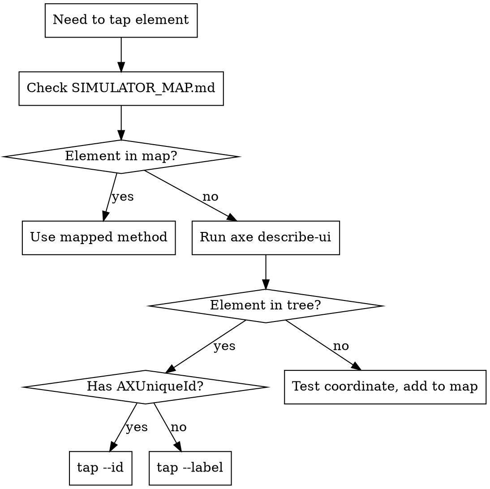

## Overview

Navigate iOS simulator apps reliably using AXe CLI for accessibility-based taps, with a fallback coordinate map for elements the accessibility tree doesn't expose.

**Core principle:** Never guess coordinates from screenshots. Either tap by accessibility label/id, or look up tested coordinates from the project's `SIMULATOR_MAP.md`.

**Always use `axe` CLI via Bash for all simulator interaction** — tapping, swiping, typing, screenshots, and UI inspection. Do NOT use `mcp__ios-simulator__*` MCP tools even if they are available. AXe supports label-based tapping which the MCP tools lack, and mixing tools causes confusion. For simulator lifecycle (boot, install, launch), use `xcrun simctl` via Bash.

## Decision Flow



## Session Start Checklist

Before your first tap in a session, verify the environment is current:

1. **Check SIMULATOR_MAP.md freshness** -- read the `last-verified` date at the top. If it's older than the current build or the app's UI has changed since then, re-run `axe describe-ui --udid $UDID` and update stale entries before relying on mapped coordinates.
2. **Confirm UDID** -- run `xcrun simctl list devices booted` and compare against the UDID in SIMULATOR_MAP.md. A mismatch means the map is for a different simulator.
3. **Find the newest build before installing** -- never hardcode a DerivedData path. Always discover it fresh:
   ```bash
   find ~/Library/Developer/Xcode/DerivedData -name "*.app" -path "*/Build/Products/Debug-iphonesimulator/*" -maxdepth 5 | xargs ls -td | head -1
   ```

## Quick Reference

| Task | Command |
|---|---|
| Inspect screen | `axe describe-ui --udid $UDID` |
| Tap by label | `axe tap --label "Button Text" --udid $UDID` |
| Tap by id | `axe tap --id "accessibilityId" --udid $UDID` |
| Tap by coordinate | `axe tap -x 200 -y 400 --udid $UDID` |
| Type text | `axe type 'hello world' --udid $UDID` |
| Swipe | `axe swipe --start-x 200 --start-y 600 --end-x 200 --end-y 200 --udid $UDID` |
| Multi-step flow | `axe batch --udid $UDID --step 'tap --label "X"' --step 'tap --id "Y" --wait-timeout 2'` |
| Screenshot | `axe screenshot --udid $UDID --output screen.png` |

## The SIMULATOR_MAP.md Pattern

Create a `SIMULATOR_MAP.md` in your iOS project root for elements that aren't in the accessibility tree. Common cases:

- **SwiftUI `Tab` items** — the `Tab` API doesn't expose individual tabs to idb
- **Custom drawn controls** — elements without accessibility markup
- **System UI** — keyboard keys, status bar elements

Format each entry with the element name, tap method, and tested command. Include device dimensions and last-verified date at the top so stale entries are obvious.

**Update the map when:**
- Layout changes (tabs added/removed, navigation restructured)
- Device or simulator dimensions change
- `axe describe-ui` shows new/changed element labels

## Making More Elements AXe-Tappable

When building SwiftUI views, add accessibility identifiers to interactive elements:

```swift
Button("Save") { ... }
    .accessibilityIdentifier("save-button")

TextField("Search", text: $query)
    .accessibilityIdentifier("search-field")
```

This doubles as VoiceOver support — accessibility win + automation win.

## Verify After Every Tap

AXe taps are fire-and-forget. Always verify the tap had the intended effect:

```bash
axe describe-ui --udid $UDID
```

## Discovering New Elements

When you navigate to a screen that isn't in SIMULATOR_MAP.md, run `axe describe-ui` to discover elements. After successfully tapping a new element, **add it to SIMULATOR_MAP.md immediately** — this saves future sessions from repeating the discovery.

## Capturing Transient UI States

Animations, overlays, permission dialogs, and other short-lived states disappear before a sequential screenshot can capture them. Use concurrent execution to fire the action and screenshot at the same time.

**Pattern: action in background + delayed screenshot**

```bash
# Tap triggers a transient overlay; screenshot captures it mid-animation
UDID=<udid>
axe tap --label "Hold to talk" --udid $UDID & sleep 0.3 && axe screenshot --udid $UDID --output /tmp/transient.png && wait
```

**Pattern: action + two screenshots (during and after)**

```bash
# Capture both the transient state and the settled state
UDID=<udid>
axe tap --label "Switch to voice input" --udid $UDID & \
  sleep 0.3 && axe screenshot --udid $UDID --output /tmp/during.png && \
  wait && sleep 1 && axe screenshot --udid $UDID --output /tmp/after.png
```

**Tuning the delay:**
- `0.1-0.3s` -- catch dialogs, overlays, mode switches as they appear
- `0.5-1.0s` -- catch states after a short animation settles
- Too short and the action hasn't triggered yet; too long and the state has dismissed

**Use cases:**
- Permission dialogs (appear then auto-dismiss on tap)
- Recording overlays (visible only while holding)
- Keyboard appearance/dismissal
- Sheet presentations from context menus
- Swipe action buttons (visible only during swipe)

## Common Mistakes

| Mistake | Fix |
|---|---|
| Using `mcp__ios-simulator__` MCP tools | Use `axe` CLI via Bash instead — it supports label-based taps |
| Guessing coordinates from a screenshot | Run `axe describe-ui` first, use labels |
| Label matches multiple elements | Use `--id` instead, or fall back to coordinates |
| Tab items not tappable by label | Known SwiftUI limitation — add to SIMULATOR_MAP |
| Tap lands during animation | Add `--pre-delay 0.5` or use `--wait-timeout` in batch |
| Stale SIMULATOR_MAP | Re-run `axe describe-ui`, update the map |
| 2+ consecutive failed taps | Stop tapping. Re-run `axe describe-ui --udid $UDID` to refresh element state -- the layout likely changed or coordinates drifted |
| Installing a stale DerivedData build | Never hardcode the `.app` path. Use `find ... \| xargs ls -td \| head -1` to discover the newest build before every `xcrun simctl install` (see Session Start Checklist) |
| Discovering new elements but not saving them | Always update SIMULATOR_MAP.md after finding new entry points |
